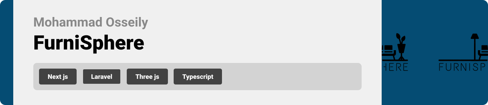

  

<!-- project philosophy -->

> A web app for browsing and purchasing furniture, providing an immersive 360-degree view of the products to enhance the shopping experience.
>
> Furniture Store aims to provide a seamless and engaging platform for customers to explore and purchase furniture. By integrating a 360-degree view feature, customers can get a comprehensive look at the products, ensuring they make informed buying decisions.

### User Stories

- As a user, I want to browse the furniture collection, so I can find pieces that suit my taste and needs.
- As a user, I want to view the furniture in 360 degrees, so I can see the product from all angles and better understand its design and quality.
- As a user, I want to be able to edit in the space of the room.
