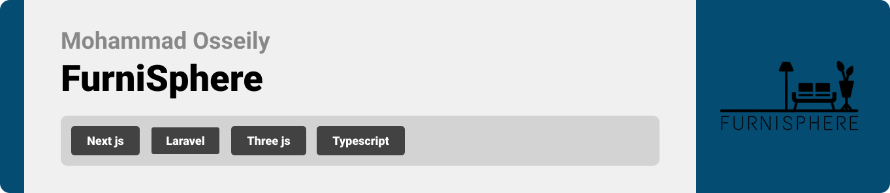

<br><br>

<!-- project philosophy -->
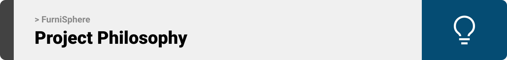

> FurniSphere offers an immersive 360-degree view of furniture, allowing users to explore products in stunning detail. AI technology enables dynamic rearrangement of 3D models, while machine learning recommends products based on user preferences. It's not just shopping—it's a personalized, interactive experience.

## 📋 Table of Contents

- [Project Overview](#project-overview)
- [User Types](#user-types)
- [Features](#features)
- [Tech Stack](#tech-stack)
- [Project Structure](#project-structure)
- [Prerequisites](#prerequisites)
- [Installation Guide](#installation-guide)
- [Database Setup](#database-setup)
- [Running the Application](#running-the-application)
- [API Documentation](#api-documentation)
- [Troubleshooting](#troubleshooting)

## 🎯 Project Overview

FurniSphere is a full-stack e-commerce platform specializing in furniture sales with an innovative 3D visualization system. The platform allows customers to:

- Browse furniture collections with detailed product information
- View products in immersive 360-degree 3D environments
- Interact with and manipulate 3D models in virtual spaces
- Receive AI-powered product recommendations
- Complete purchases through a streamlined checkout process

## 👥 User Types

FurniSphere supports two distinct user roles:

### 1. **Regular User** (Default Role: `user`)

Regular customers who can:

- Browse and search furniture products
- View products in 3D interactive environments
- Add items to shopping cart
- Place orders and track order history
- View personalized product recommendations
- Manage their profile and account settings

### 2. **Administrator** (Role: `admin`)

Admin users with full system access who can:

- **Product Management**: Add, edit, and delete products and categories
- **3D Model Management**: Upload and position 3D models in virtual spaces
- **Order Management**: View all orders, update order statuses, and manage order items
- **User Management**: View, update, and delete user accounts
- **Analytics**: Access user activity data and system analytics

> **Note**: User roles are stored in the `users` table with an enum field (`'user'` or `'admin'`). New registrations default to `'user'` role. Only existing admin users can change user roles.

## ✨ Features

### User Features

- Browse furniture collection with filtering and search
- 360-degree 3D product visualization using Three.js
- Interactive 3D room manipulation
- Shopping cart and checkout system
- Order history tracking
- AI-powered product recommendations
- User activity tracking for personalized experience

### Admin Features

- Complete product catalog management
- 3D model upload and positioning system
- Order status management
- User account management
- Dashboard with analytics

### User Stories

- As a user, I want to browse the furniture collection, so I can find pieces that suit my taste and needs.
- As a user, I want to view the furniture in 360 degrees, so I can see the product from all angles and better understand its design and quality.
- As a user, I want to be able to edit in the space of the room.

### Admin Stories

- As an admin, I want to update the order status, so I can keep customers informed about the progress of their orders.
- As an admin, I want to update user profiles, so I can manage customer information and provide better service.
- As an admin, I want to edit the 3D model positions, so I can ensure the furniture items are displayed accurately in the virtual space.
- As an admin, I want to add new products to the furniture collection, so the catalog remains up to date with the latest offerings.

<br><br>

<!-- Tech stack -->
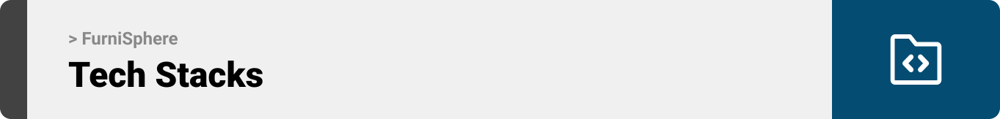

## 🛠 Tech Stack

### Frontend

- **Next.js 14.2.5**: React framework with server-side rendering
- **Three.js**: 3D graphics library for interactive product visualization
- **React Three Fiber**: React renderer for Three.js
- **TypeScript**: Type-safe JavaScript
- **TailwindCSS**: Utility-first CSS framework
- **Redux Toolkit**: State management
- **Axios**: HTTP client for API requests

### Backend

- **Laravel 10**: PHP framework for robust API development
- **MySQL**: Relational database management
- **JWT Authentication**: Secure token-based authentication
- **Laravel Sanctum**: API token authentication

### Additional Technologies

- **Machine Learning**: Python-based recommendation system
- **AWS**: Cloud deployment and AI model hosting
- **phpMyAdmin**: Database management interface

<br><br>

<!-- UI UX -->


> We designed FurniSphere using wireframes and mockups, iterating on the design until we reached the ideal layout for easy navigation and a seamless user experience.

- Project Figma design [figma](https://www.figma.com/design/zwUhOLaPRnJbtnQzqAMyBs/FurniSpher?node-id=0-1&node-type=canvas&t=cP2lOQMxKSyh8nuS-0)

### Mockups

| Order History                        | Products Page                        |
| ------------------------------------ | ------------------------------------ |
| 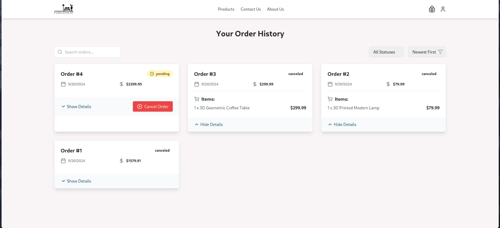 | 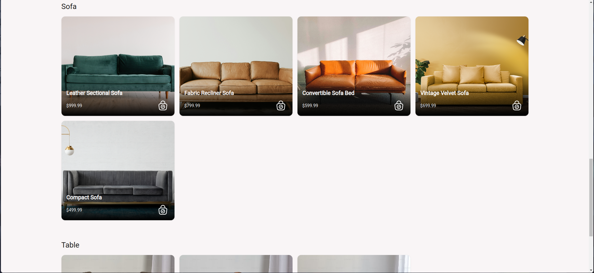 |

<br><br>

<!-- Database Design -->
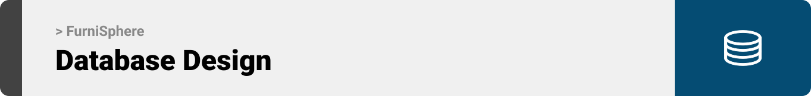

### Architecting Data Excellence: Innovative Database Design Strategies:

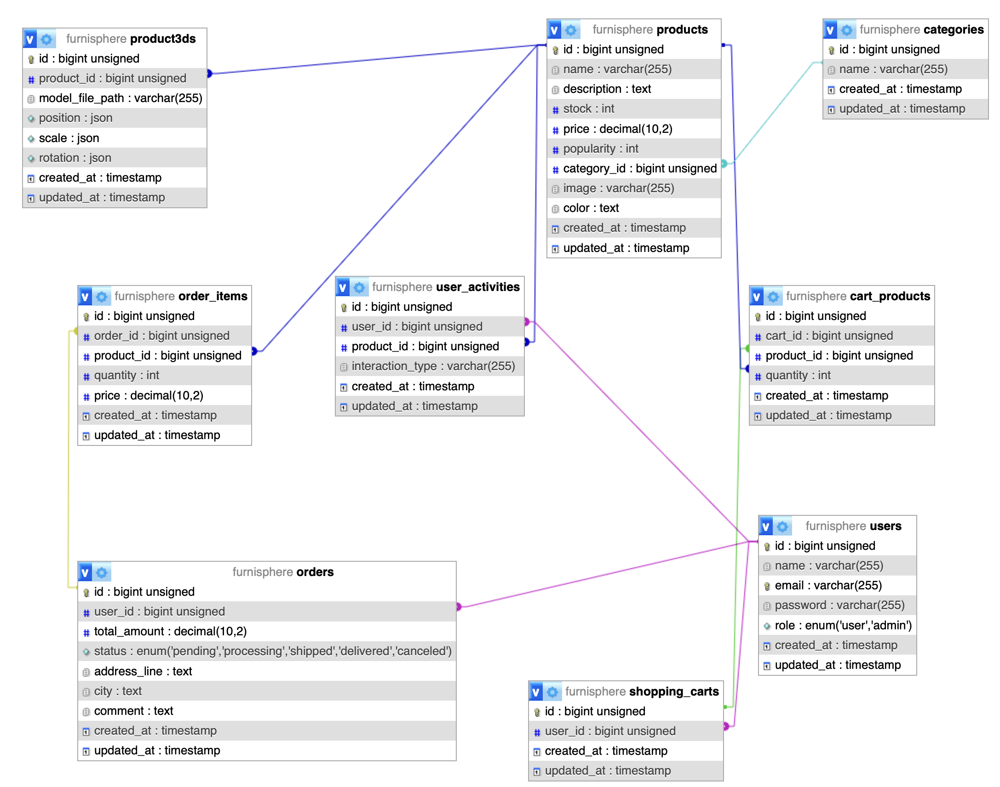

### Database Schema

The application uses MySQL with the following main tables:

- **users**: User accounts with role-based access (user/admin)
- **products**: Furniture product catalog
- **categories**: Product categorization
- **product3ds**: 3D model associations
- **orders**: Customer orders
- **order_items**: Individual order line items
- **shopping_carts**: Active shopping carts
- **cart_products**: Cart item associations
- **user_activities**: User behavior tracking for recommendations

<br><br>

<!-- Implementation -->
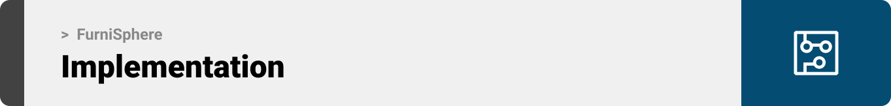

### User Screens

| Home Page                              | 3D screen                           |
| -------------------------------------- | ----------------------------------- |
|  | 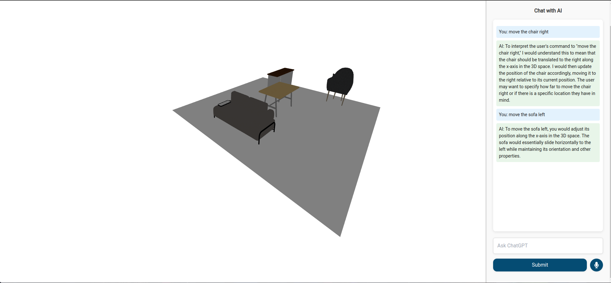 |

### Admin Screens

| Order Mangment                              | Add Products                           |
| ------------------------------------------- | -------------------------------------- |
| 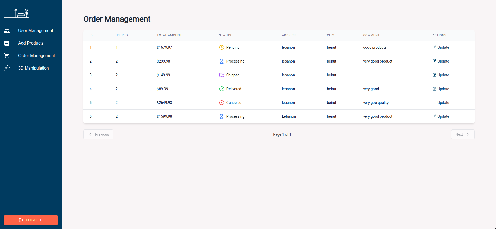 | 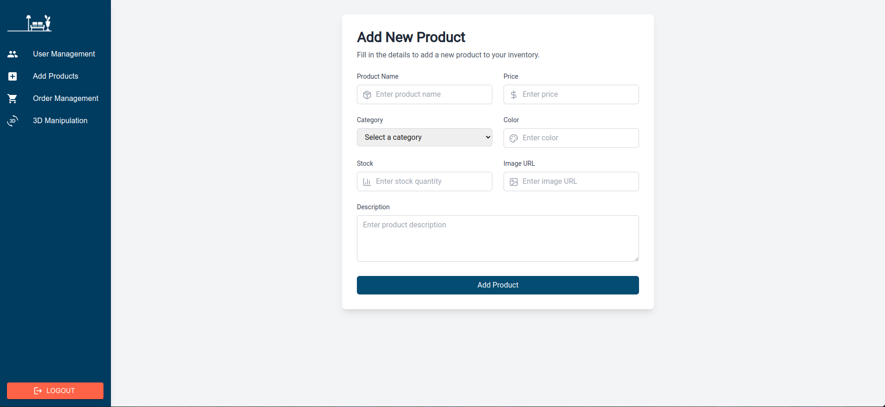 |

<br><br>

<!-- Prompt Engineering -->
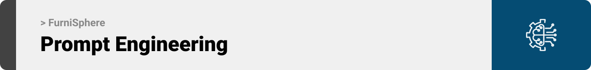

### Enhancing 3D Shopping Experience with AI and Machine Learning:

- This project leverages 3D technology to showcase products interactively, allowing users to view and manipulate the product positions in a virtual environment. AI is integrated to enable dynamic changes in the 3D product placement, while machine learning algorithms analyze user behavior on the site to recommend products based on their interests, creating a personalized shopping experience.

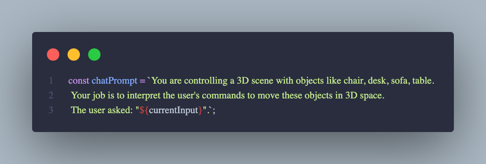

<br><br>

<!-- AWS Deployment -->
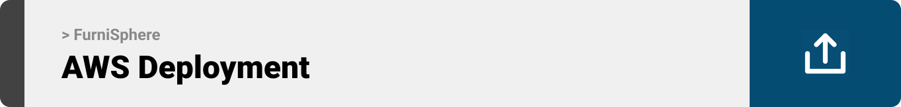

### Efficient AI Deployment: Unleashing the Potential with AWS Integration:

- This project leverages AWS deployment strategies to seamlessly integrate and deploy natural language processing models. With a focus on scalability, reliability, and performance, we ensure that AI applications powered by these models deliver robust and responsive solutions for diverse use cases.

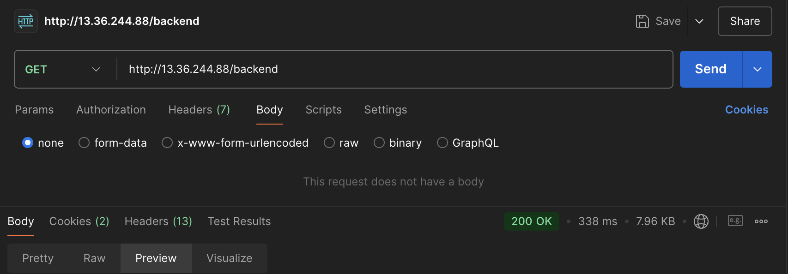

<br><br>

<!-- Unit Testing -->


### Precision in Development: Harnessing the Power of Unit Testing:

- This project employs rigorous unit testing methodologies to ensure the reliability and accuracy of code components. By systematically evaluating individual units of the software, we guarantee a robust foundation, identifying and addressing potential issues early in the development process.

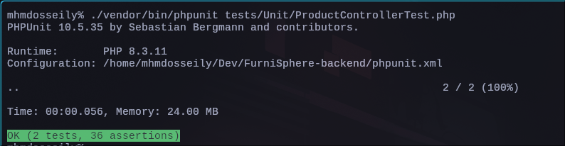

<br><br>

## 📁 Project Structure

```
FurniSphere-fullstack/
├── FurniSphere-backend/          # Laravel API Backend
│   ├── app/
│   │   ├── Http/
│   │   │   ├── Controllers/      # API Controllers
│   │   │   └── Middleware/       # Auth & Admin middleware
│   │   ├── Models/               # Eloquent Models
│   │   └── machinLearn/          # ML recommendation system
│   ├── database/
│   │   ├── migrations/           # Database migrations
│   │   └── seeders/              # Database seeders
│   ├── routes/
│   │   └── api.php               # API routes
│   └── config/                   # Configuration files
│
└── FurniSphere-frontend/          # Next.js Frontend
    ├── app/                       # Next.js app directory
    │   ├── components/            # React components
    │   ├── services/              # API service functions
    │   └── types/                 # TypeScript type definitions
    └── public/
        └── models/                # 3D GLB model files
```

<!-- How to run -->


## 📦 Prerequisites

Before you begin, ensure you have the following installed on your system:

### Required Software

1. **Node.js** (v18 or higher)

   ```bash
   # Check if installed
   node --version

   # Install via Homebrew (macOS)
   brew install node

   # Or download from https://nodejs.org/
   ```

2. **PHP** (v8.1 or higher)

   ```bash
   # Check if installed
   php --version

   # Install via Homebrew (macOS)
   brew install php

   # Or for Linux
   sudo apt install php php-cli php-mysql php-mbstring
   ```

3. **Composer** (PHP dependency manager)

   ```bash
   # Check if installed
   composer --version

   # Install (macOS/Linux)
   php -r "copy('https://getcomposer.org/installer', 'composer-setup.php');"
   php -r "if (hash_file('sha384', 'composer-setup.php') === 'dac665fdc30fdd8ec78b38b9800061b4150413ff2e3b6f88543c636f7cd84f6db9189d43a81e5503cda447da73c7e5b6') { echo 'Installer verified'; } else { echo 'Installer corrupt'; unlink('composer-setup.php'); } echo PHP_EOL;"
   php composer-setup.php
   php -r "unlink('composer-setup.php');"

   # Move to global location
   sudo mv composer.phar /usr/local/bin/composer
   ```

4. **MySQL** (v8.0 or higher)

   ```bash
   # Check if installed
   mysql --version

   # Install via Homebrew (macOS)
   brew install mysql
   brew services start mysql

   # Or for Linux
   sudo apt install mysql-server
   ```

5. **Git**
   ```bash
   # Check if installed
   git --version
   ```

## 🚀 Installation Guide

### Step 1: Clone the Repository

```bash
# Clone the fullstack repository
git clone https://github.com/mohammad-osseily/FurniSphere-fullstack.git
cd FurniSphere-fullstack
```

### Step 2: Backend Setup

```bash
# Navigate to backend directory
cd FurniSphere-backend

# Install PHP dependencies
composer install

# Copy environment file
cp .env.example .env

# Generate application key
php artisan key:generate

# Generate JWT secret (you'll need to add this to .env)
# You can use: php artisan jwt:secret
# Or generate a random string and add it to .env as JWT_SECRET
```

### Step 3: Configure Environment Variables

Edit the `.env` file in `FurniSphere-backend/` and configure:

```env
APP_NAME=FurniSphere
APP_ENV=local
APP_KEY=                    # Generated by php artisan key:generate
APP_DEBUG=true
APP_URL=http://localhost

DB_CONNECTION=mysql
DB_HOST=127.0.0.1
DB_PORT=3306
DB_DATABASE=furnishpere    # Or your preferred database name
DB_USERNAME=root
DB_PASSWORD=               # Your MySQL password (leave empty if none)

JWT_SECRET=                # Generate a secure random string
JWT_ALGO=HS256
```

### Step 4: Frontend Setup

```bash
# Navigate to frontend directory (from project root)
cd FurniSphere-frontend

# Install Node.js dependencies
npm install

# If you encounter nanoid errors, install it explicitly
npm install nanoid
```

### Step 5: Database Setup

```bash
# Create the database (from MySQL command line or phpMyAdmin)
mysql -u root -p
CREATE DATABASE furnishpere CHARACTER SET utf8mb4 COLLATE utf8mb4_unicode_ci;
EXIT;

# Or if no password:
mysql -u root
CREATE DATABASE furnishpere CHARACTER SET utf8mb4 COLLATE utf8mb4_unicode_ci;
EXIT;

# Run migrations (from backend directory)
cd FurniSphere-backend
php artisan migrate

# Seed the database with sample data
php artisan db:seed
```

## ▶️ Running the Application

### Start the Backend Server

```bash
cd FurniSphere-backend
php artisan serve
```

The backend will be available at: **http://localhost:8000**

### Start the Frontend Server

Open a new terminal window:

```bash
cd FurniSphere-frontend
npm run dev
```

The frontend will be available at: **http://localhost:3000** (or next available port like 3001)

### Access the Application

- **Frontend**: http://localhost:3000
- **Backend API**: http://localhost:8000/api
- **phpMyAdmin** (if installed): http://localhost:8080/phpmyadmin

## 🗄️ Database Management

### Using phpMyAdmin

1. Access phpMyAdmin at: http://localhost:8080/phpmyadmin
2. Login with:
   - **Username**: `root`
   - **Password**: (your MySQL password, or leave empty)
3. Select the `furnishpere` database
4. Browse and manage tables

### Using MySQL Command Line

```bash
# Connect to MySQL
mysql -u root -p

# Or without password
mysql -u root

# Use the database
USE furnishpere;

# View all tables
SHOW TABLES;

# View data from a table
SELECT * FROM products LIMIT 10;
```

## 📡 API Documentation

### Authentication Endpoints

- `POST /api/register` - Register a new user (defaults to 'user' role)
- `POST /api/login` - Login and receive JWT token
- `POST /api/logout` - Logout (requires authentication)
- `POST /api/refresh` - Refresh JWT token

### Product Endpoints

- `GET /api/products` - Get all products
- `GET /api/products/{id}` - Get single product
- `GET /api/categories-with-products` - Get categories with products
- `POST /api/products` - Create product (Admin only)
- `PUT /api/products/{id}` - Update product (Admin only)
- `DELETE /api/products/{id}` - Delete product (Admin only)

### Order Endpoints

- `GET /api/orders` - Get user's orders (Auth required)
- `GET /api/orders/{id}` - Get single order (Auth required)
- `POST /api/orders` - Create new order (Auth required)
- `PUT /api/orders/{id}/status` - Update order status (Admin only)

### Admin Endpoints (Require Admin Role)

- `GET /api/users` - List all users
- `PUT /api/users/{id}` - Update user (including role)
- `DELETE /api/users/{id}` - Delete user
- `GET /api/admin/orders` - Get all orders
- `POST /api/categories` - Create category
- `PUT /api/categories/{id}` - Update category
- `DELETE /api/categories/{id}` - Delete category

> **Note**: Admin endpoints require JWT authentication with `role: 'admin'` in the user record.

## 🔧 Troubleshooting

### Common Issues

#### 1. CORS Errors

If you see CORS errors, ensure your frontend URL is in the allowed origins:

- Edit `FurniSphere-backend/config/cors.php`
- Add your frontend URL to `allowed_origins` array

#### 2. Database Connection Errors

- Verify MySQL is running: `brew services list | grep mysql`
- Check database credentials in `.env`
- Ensure database exists: `mysql -u root -e "SHOW DATABASES;"`

#### 3. Missing Dependencies

```bash
# Backend
cd FurniSphere-backend
composer install

# Frontend
cd FurniSphere-frontend
npm install
npm install nanoid  # If you see nanoid errors
```

#### 4. Port Already in Use

```bash
# Find process using port 8000
lsof -ti:8000

# Kill the process
kill -9 $(lsof -ti:8000)

# Or use a different port
php artisan serve --port=8001
```

#### 5. JWT Secret Not Set

```bash
# Generate JWT secret and add to .env
php artisan jwt:secret

# Or manually add to .env:
# JWT_SECRET=your-secret-key-here
```

#### 6. Migration Errors

```bash
# Reset database (WARNING: Deletes all data)
php artisan migrate:fresh --seed

# Or rollback and re-run
php artisan migrate:rollback
php artisan migrate
```

### Getting Help

- Check Laravel logs: `FurniSphere-backend/storage/logs/laravel.log`
- Check Next.js console for frontend errors
- Verify all environment variables are set correctly
- Ensure all services (MySQL, PHP, Node) are running

## 📝 Additional Notes

- The application uses JWT for authentication
- Admin users can be created by updating the `role` field in the database to `'admin'`
- 3D models are stored in `FurniSphere-frontend/public/models/` as GLB files
- User activities are tracked for ML-based recommendations
- The backend API follows RESTful conventions

---

**Happy Coding! 🚀**

Now, you should be able to run FurniSphere locally and explore its features.
